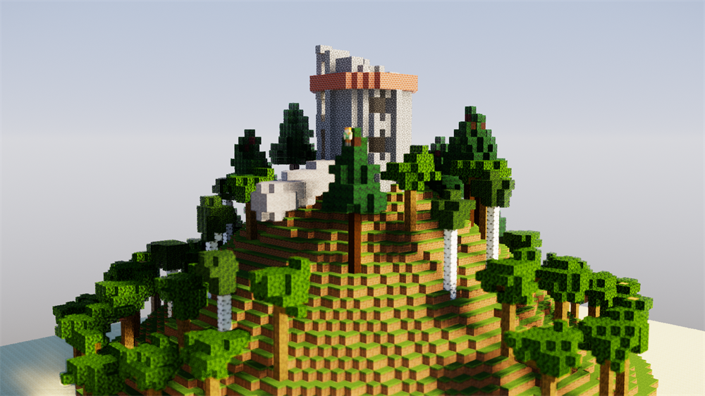
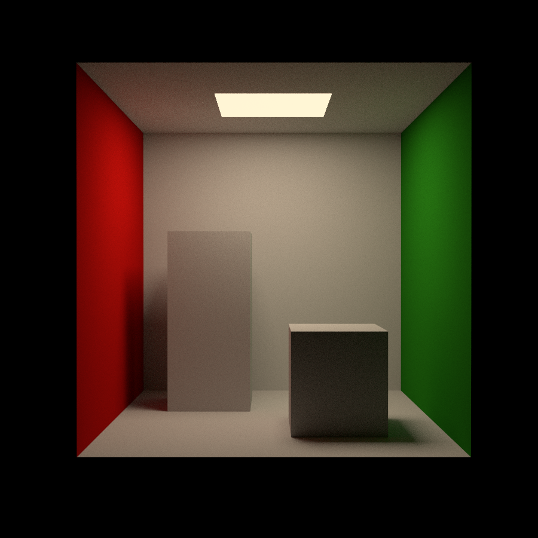
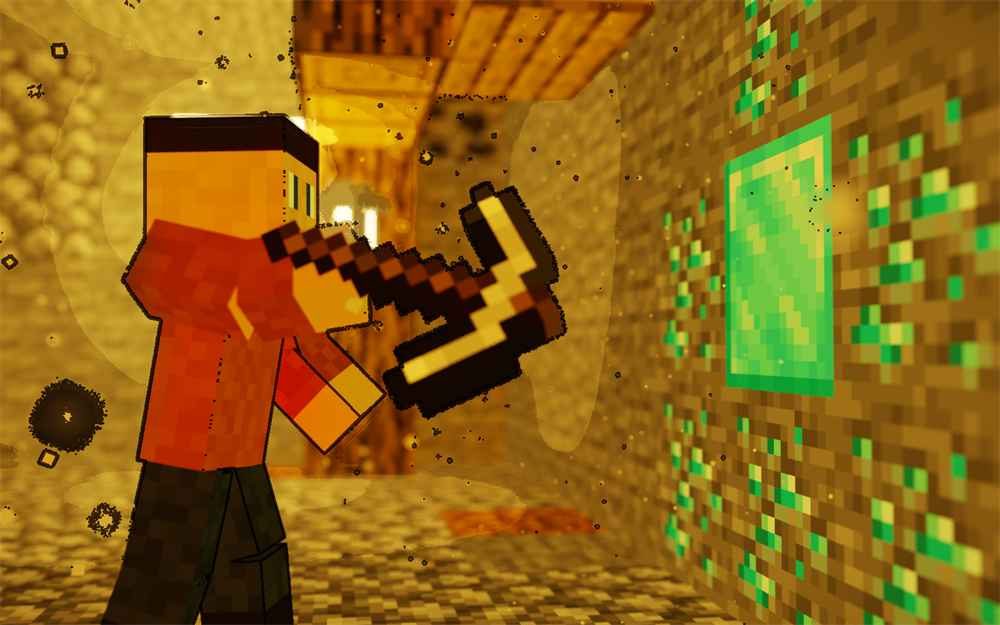
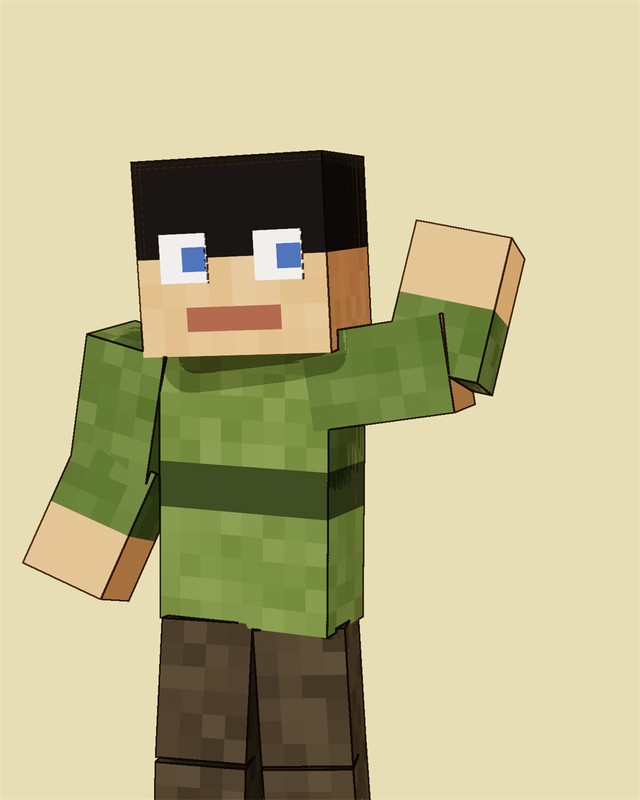
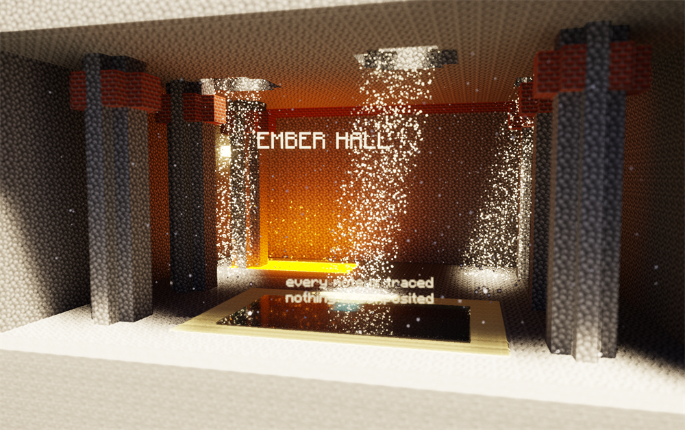
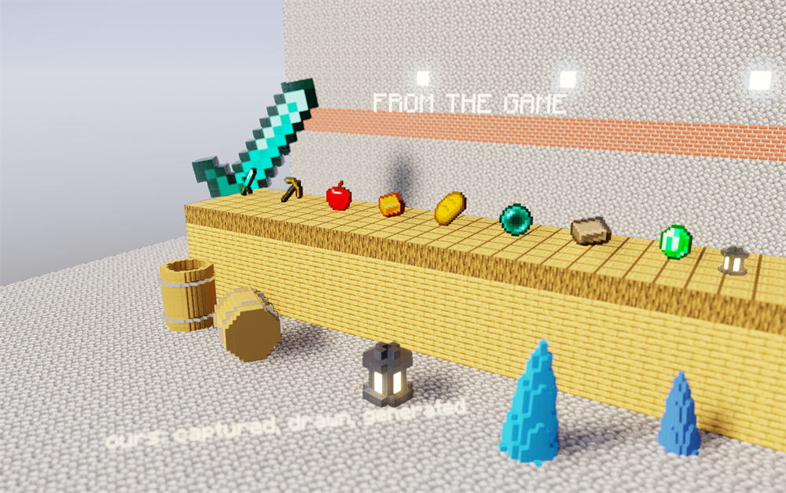
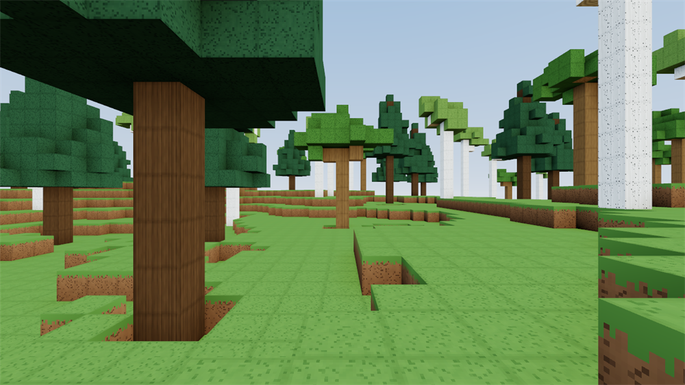

# BlockyEngine

[по-русски](README.ru.md) · [Install](docs/install.md) · [Gallery](docs/gallery.md) · [Documentation](#documentation) · [Contributing](CONTRIBUTING.md)

**Windows 10/11, x64.** Linux is planned and not here yet; `docs/install.md`
says [what stands in the way](docs/install.md#linux) rather than only that it
is coming.



A voxel engine in C++, in the visual language of Minecraft. Two things get made
with it, and both are written in ordinary C++: it **computes a frame** and it
**runs a world**.

A frame is a file in `scenes/`: describe a world in code, rebuild, get a
picture or a take. The world that runs is `game/`: the same voxel world, but
one you walk through, in which rigid bodies fall and are fastened to each
other, and whose rules are written by a script that reloads without closing the
window.

It began as a renderer, and the renderer stayed the reason the rest is accurate
enough: physics moves the same props the tracer later shades, the character
controller walks the same lattice a ray walks, and the viewport draws the same
`Scene` the path tracer will be handed.

Not one external library. The PNG codec, the ZIP reader, the OpenGL loader, a
window on Win32, a path tracer — first on the processor, then the same one on
compute shaders — a rasteriser, a denoiser, a rigid-body solver, its own
scripting language and, since it had come to that, H.264. All of it its own.
After turning down glm, stopping at somebody else's video codec would have been
a strange place to show restraint.

```cpp
// scenes/demo.cpp
#include "engine/core/png.hpp"
#include "engine/render/trace/pathtrace.hpp"
#include "engine/scene/scene.hpp"
#include "scenes/common/palette.hpp"

using namespace blocky;

int main() {
    Scene scene(palette::registry());        // the engine knows no blocks: you bring the palette
    scene.world.fillBox({-8, -1, -8}, {8, -1, 8}, palette::Stone);
    scene.world.fillSphere({0, 3, 0}, 3.0f, palette::GoldBlock);
    scene.world.set({0, 8, 0}, palette::Glowstone);

    scene.frameAll();                       // isometric, framed on the world's extent

    PathSettings settings;
    settings.width = 800;
    settings.height = 500;
    settings.samplesPerPixel = 64;

    Image frame = renderPath(scene, settings);
    pngSave("out/demo.png", frame);
    return 0;
}
```

```
build.cmd release run demo
```

---

## Gallery

| | | |
|---|---|---|
|  |  |  |
|  |  |  |

Fourteen more frames, with a note on what each one is showing, are in
[docs/gallery.md](docs/gallery.md). All of them were made by scenes in this
repository and none of them was retouched.

---

## Documentation

The deeper documents are in Russian for now; this page and the gallery are in
both. Translating the rest is on the list.

| Section | About |
|---|---|
| [Architecture](docs/architecture.md) | Layers, the path of a frame, the decisions taken and why those |
| [Conventions](docs/conventions.md) | Units, axes, colour space, signs of rotation, time |
| [Writing scenes](docs/authoring.md) | The working loop and recipes: modelling, generation, light, post, takes |
| [Viewport](docs/viewport.md) | Interactive preview, controls, snapshot mode |
| [Editor](docs/forge.md) | forge: voxel models and pixel textures, controls, export |
| [Installing](docs/install.md) | What to install, how to build, and what to do when it will not |
| [Tests](docs/testing.md) | What is covered, and how |
| [Gallery](docs/gallery.md) | Frames, and what each one shows |

**API reference**

| Section | Modules |
|---|---|
| [core](docs/api-core.md) | `math`, `image`, `random`, `file`, `deflate`, `png` (APNG included), `zip` |
| [world](docs/api-world.md) | `block`, `world`, `raycast`, `noise`, `shapes`, `vegetation` |
| [scene and render](docs/api-render.md) | `camera`, `scene`, `direct`, `pathtrace`, `intersect`, `bsdf`, `lights`, post-processing |
| [gpu](docs/api-gpu.md) | `raycast_gpu`, `pathtrace_gpu`, `wavefront_gpu`, `denoise_gpu` — the same tracer on compute shaders |
| [assets and entity](docs/api-assets.md) | `texture`, `asset_source`, block textures, skins, models, entities |
| [sprite](docs/api-sprite.md) | `sprite`, `sprite_set`, `font`, `text`, `scatter` — particles and floating text |
| [prop](docs/api-prop.md) | `voxel_model`, `prop_set`, `item`, `voxelize` — voxel items and props |
| [rig](docs/api-rig.md) | `rig`, `rigging`, `prop_rig`, `face` — skeleton, fine detail, outer layers, the eye rig |
| [anim](docs/api-anim.md) | `timing`, `ease`, `track`, `blend`, `take` — time, curves, a take |
| [physics](docs/api-physics.md) | `body`, `collider`, `contact`, `constraint`, `physics_world`, `pick`, `character` — rigid bodies, joints, ray casts against bodies, the character controller and swimmer |
| [script](docs/api-script.md) | A language of its own for the sandbox: values, parser, interpreter, bindings, reload |
| [texture_gen](engine/assets/blocks/texture_gen.hpp) | The verbs of procedural texture: tile, grain, speckle, brickwork. The recipes belong to whoever owns the blocks |
| [video](docs/api-video.md) | `h264`, `mp4`, `encode` — its own container and its own codec |

---

## Building

The compiler, CMake and Ninja live inside the Visual Studio Build Tools and are
**not on PATH**. `build.cmd` finds the installation itself — through `vswhere`,
or `BLOCKY_VSROOT` if you would rather say — brings the x64 environment up and
does the rest; there is no need to call `cmake` directly.

Step by step, including which components to tick and what the errors mean:
[docs/install.md](docs/install.md).

| Command | What it does |
|---|---|
| `build.cmd` | Configure if needed, then build Debug |
| `build.cmd release` | Build RelWithDebInfo — the only one worth rendering with |
| `build.cmd run <name>` | Build, then run `scenes/<name>.cpp` from the project root |
| `build.cmd clean` | Wipe the `build/` directory |

The game builds with the same `build.cmd release` and lands at
`build\RelWithDebInfo\konstruct.exe`. That is the difference the `game/`
directory exists to mark: there, every `.cpp` is part of one executable; in
`scenes/`, every `.cpp` *is* one.

`build.cmd` passes no arguments to a scene. Run the executable directly if you
need them: `build\RelWithDebInfo\scenes\scene_diorama.exe draft`.

**Needs:** MSVC 14.5+ (C++20), the Windows SDK, and the "C++ CMake tools for
Windows" component, which is where CMake and Ninja come from. Nothing else —
the engine has no dependencies to fetch. Minecraft's game files are **not
required**: without them the scenes render with a flat palette and the game
generates its own textures.

> The project path here contains a Cyrillic `С`. MSVC, CMake and Ninja digest
> it; the narrow CRT functions do not, which is why all file I/O goes through
> `readFileBytes` / `writeFileBytes` with a conversion to UTF-16. Do not route
> around them.

---

## Reference hardware

Every timing quoted anywhere in this repository was measured on one machine,
and it is a laptop:

| | |
|---|---|
| CPU | Intel Core i7-13620H — 10 cores, 16 threads, 2.4 GHz base |
| RAM | 16 GB, 5600 MT/s |
| GPU | NVIDIA GeForce RTX 4050 Laptop, 6 GB, driver 596.36, OpenGL 4.6 |
| | Intel UHD Graphics alongside it — switchable, and the discrete card is the one to be on |
| Storage | NVMe SSD |
| OS | Windows 11, build 26200 |
| Toolchain | MSVC 14.50.35717, Windows SDK 10.0.26100, CMake 4.2.3, Ninja 1.12.1 |

**It throttles, and that matters more than the model numbers.** The same
single-threaded work measured between 3.8 and 9.8 seconds on this machine
depending only on how warm it already was — a factor of about three, with
nothing else changed. So every number here is a **ratio measured inside one
run**, never a stopwatch reading to be compared against yours, and anything
sensitive to it says so where it is quoted.

This is not a requirement. The CPU renderer needs nothing but a compiler, and
the viewport needs OpenGL 4.6; see [docs/install.md](docs/install.md#the-graphics-card).
It is here so that "3.4 seconds against 68" means something.

---

## Module map

```
engine/core/            maths, images, PNG and APNG, ZIP, files, RNG, BVH
engine/world/           the block palette, sparse storage, ray traversal,
                        noise, modelling, vegetation
engine/scene/           camera, lighting, what a scene holds, material style
engine/assets/          the shared half: Texture, AssetSource
  blocks/               block textures -- by name and by face
  entity/               skins -- by rectangle inside an image; and drawing one
engine/rig/             the skeleton: joints, hierarchy, pose. Knows no seconds
engine/entity/          box models, ray intersection, rigging tools, finding
                        the eyes on a face, voxel attachments to joints
engine/sprite/          quads for particles and text, a font, scatters
engine/prop/            voxel grids: items from the game, and models of our own
engine/render/trace/    direct render, path tracer, the shared intersection
engine/render/post/     denoiser, bloom, grading, vignette, styles
engine/render/gl/       GL loader, GPU resources, viewport, offscreen target,
                        post pass, the 2D interface layer
engine/render/gpu/      the same tracer on compute shaders: traversal,
                        megakernel, wavefront, denoiser
engine/anim/            time: frame, curves, tracks, a take. Never touches the renderer
engine/physics/         rigid bodies, decomposition of voxels into boxes,
                        contacts against the lattice and between bodies by
                        face clipping, joints (rope, ball socket, hinge, weld)
                        with rotation limits, an impulse solver, sleeping by
                        island, freezing, removal and ray casts against bodies;
                        separately, a kinematic character controller and swimmer
engine/script/          a language of its own: lexer, parser, interpreter, core,
                        bindings to the world and to physics, live reload
engine/edit/            the editor's documents: undo, a pixel canvas, voxel
                        sculpting, a sprite list; export to C++ source, to a
                        layer sheet and to a Minecraft model
engine/video/           H.264 and MP4 -- its own container and its own codec
engine/platform/        a window on Win32
scenes/                 every .cpp becomes its own executable
game/                   all of it together becomes one konstruct.exe
plugins/<name>/         all of it together becomes one <name>.exe -- forge, so far
```

The engine is thirty-five thousand lines across 189 files, the scenes
twenty-one and a half thousand across fifty-five, the game six and a half
thousand across thirty-one, and the editor eighteen hundred across twelve.

There is not one `#include "game/"` in the engine, and not one block name
either: a `BlockRegistry` arrives holding air, and what goes in after that is
said by whoever is building the world. The details are in the
[architecture](docs/architecture.md).

---

## The game

```
build\RelWithDebInfo\konstruct.exe
```

It comes up in a main menu standing over a real world that turns slowly. Not a
picture and not a panorama: it is the same viewport over the same `Scene`, so
the background cannot go stale — it *is* the engine, showing itself.

| Key | Action |
|---|---|
| Mouse | Look |
| `W` `A` `S` `D` | Walk, `Shift` to run, `Space` to jump |
| Left button | Break; hold to keep digging |
| Right button | Place the block in hand |
| `1`–`9`, wheel | What is in hand: the physgun in the first slot, blocks after it |
| `Q` | Spawn menu: props and ragdolls |
| `F5` | First person / third person |
| `F3` | Look: `PLAIN` → `VIVID` → `CEL` → `INK` |
| `F1` | Debug line |
| `Esc` | Pause menu |
| `-` and `=` | Mouse speed |

**In water** `Space` swims up and `Shift` swims down. That is not a separate
mode: while there is something underfoot a jump stays a jump, and sprinting
means nothing in water, so the same key dives.

**The physgun is a thing in your hand, not a mode.** It sits in the first slot
of the same row as the blocks, comes out with `1` or the wheel, and while it is
in hand the mouse belongs to it. There is deliberately no toggle key: a key is
invisible — nothing on screen says whether it is pressed — and it would make
the tool a different sort of thing from a block, which it is not. Both are what
is in your hand, and both decide what the mouse buttons do.

| | |
|---|---|
| Left button | Hold; release to let go |
| Wheel | Closer and further |
| `E` + mouse | Turn what you are holding |
| Right button | Freeze — whatever is in the beam, or whatever you are looking at |
| `R` | Unfreeze everything |

To start with it in hand: `konstruct physgun`.

**It takes blocks too.** Aimed at the world rather than at a body, the trigger
lifts the block itself: the cell empties and a rigid body of the same size and
colour stands up where it was. That is not a special case bolted on, it is
exactly what [props](docs/api-prop.md) exist for: a block is a cell on a
lattice and cannot turn, so a thing carried at an angle has to stop being one.

The world really does come apart, and the block does not go back by itself:
once lifted, it is furniture. Which is why the hint under the hotbar changes
from `GRAB` to `LIFT THIS BLOCK` when the crosshair is on the world rather than
on a body — a trigger that silently dismantles a wall owes you a word first.

### The spawn menu

`Q` opens a shelf: a crate, a barrel, a plank, a beam, a ball, a lamp and a
ragdoll. A click puts one in front of you.

The world **does not stop** while it is open, unlike the pause menu. You spawn
a thing in order to watch it fall, and a menu that freezes the fall turns that
into two operations. It takes only the pointer: the cursor comes back, so
walking and looking are off for as long as it is up.

The ragdoll used to be its own key `G` and stopped being one for the same
reason the physgun stopped being key `F`: one thing you can place is a key, and
two things are a menu somebody never wrote. Now there is one door in, and there
is room inside it.

The catalogue lives in `game/props.cpp` and is built in code, like the block
textures and the fallback skin: the game still requires no asset files. The
tiles in the menu are drawn **by the models themselves** — an orthographic
front view, one rectangle per voxel column — because the model is already here
and the overlay already knows how to draw rectangles.

No more than forty-eight props are kept, and no more than eight ragdolls, for
the same reason: the broad phase is quadratic in bodies, so a pile that only
grows is a game that gets slower the longer it is played.

### Looks

The viewport draws the world into a linear HDR buffer, and one pass at the end
turns it into a picture — the same order the CPU renderers use: `Image` is
linear, `post/` filters it, and the tone curve fires exactly once.

| | |
|---|---|
| `PLAIN` | As it was: shading, exposure, tonemap |
| `VIVID` | The same world, shot properly: bloom on glowstone and lava, a little more colour, a vignette |
| `CEL` | Four steps of light and an outline taken from geometry |
| `INK` | The outline without the steps, colour muted |

**Cel has two seams, and that is not a quibble.** The steps are applied during
shading, because what has to be quantised is *illumination*, and by the time a
frame is finished it has already been multiplied by albedo — banding the colour
would band the texture along with the light. The outline is applied in the post
pass, because an edge needs its neighbours. The same division the
[architecture](docs/architecture.md) describes for the tracer.

The outline comes from **depth and normals**, not from the picture. An
image-space filter would trace every texture boundary as well, which is to say
every face of every block — that is a colouring book, not cel.

### Single player

Two kinds, and the difference is not how they are stored — both are code,
because there is no world format here and a scene is deliberately not one. The
difference is what they are for.

| | |
|---|---|
| **NEW WORLD** | Different every time, and the same every time for a given seed. You go there to be somewhere new. `R` in the menu rolls another seed |
| **be_construct** | A flat build site: a marked floor, a wall with lamps, a tower with platforms, a pool with a shallow half and a deep one, stairs of one, two and three blocks, a row of material samples, a lava pit |
| **be_lake** | A bowl of water ringed by forest, a sand shore, an island with a tree in the middle |
| **be_valley** | A river between two ridges: spruce on top, oak and birch by the water, snow on the crests |

The named maps are the same for everybody and always, and everyone arrives at
the same spot — which is the whole point of a build site.

Arguments: `look=<name>`, `seed=`, `extent=`, `map=<name>` (starts straight
away, skipping the menu), `menu` / `menu=play` / `menu=paused`,
`script=<file>`, `skin=<png>`, `third`, `snapshot <png>` with `frames=`,
`yaw=`, `pitch=`, `dist=`, `swing`, `still`, `ragdoll` / `ragdoll=<n>`,
`physgun`, `spawn` (open the shelf), `props` (place one of each) and `lift`
(take a block out of the floor with the physgun).

**`konstruct textures`** stands apart — it starts nothing, and writes a contact
sheet of every generated tile plus a traced showcase made of them (`sheet` for
the sheet alone, instantly; `size=64` for another resolution). This was the
scene `scene_textures` while the texture recipes lived in the engine; they
belong to the game now, and a scene cannot link against the game, so the tool
moved to where the pixels are.

The last few are about the same thing the whole snapshot mode is about:
interface you cannot reach from a build script is interface that is not checked
at all. A snapshot has no mouse, so `swing` swings by itself, `ragdoll` throws
by itself, and `physgun` draws the tool and takes hold of whatever is in front
of it. In a snapshot the debug line is on without `F1` — the numbers are the
reason you take a snapshot when you are checking something rather than looking
at it.

`physgun` works in a window too: there it simply starts the game with the tool
in hand instead of pressing `1`.

### Health and stamina

A bar that cannot move is decoration, and decoration that looks like a mechanic
is worse than none: it promises that the world can hurt you and does not
deliver. So the **sources** came first and the bars came last.

| | |
|---|---|
| Falling | Costs above `13` m/s. A jump lands at 8.6, so on level ground there is nothing to hurt yourself with |
| Water | Twelve seconds of air, then you drown. Surface, and you breathe |
| Lava | Nobody survives it, and nobody should: a couple of seconds is enough to get out if you go straight away |
| The void | Below the world is the end. It became reachable the day fluids stopped being solid: two blocks of lava over nothing is a hole |
| Stamina | Spent running and swimming, and an empty bar mutes `Shift`. That is a rule about movement, not a number going down |
| Healing | Slow, and **paid for out of stamina**, so somebody who has just run across a valley does not heal on the way. The only coupling between the two bars, and the thing that stops them being two separate decorations |

There is no death screen: at zero you come round at the spawn point with full
bars. A sandbox is a place to try things, and the price of a mistake is the
walk back.

The bars stand in one column above the hotbar rather than in three corners. Air
shows only when it is less than full: a bar that is always full whenever it is
visible is a bar nobody reads.

### A character, not a camera

The difference is assembled out of things each of which is unremarkable alone:

- **The gait runs on distance covered, not on the clock.** Walk into a wall
  holding `W` and the legs stop, because the ground stopped. There is no
  special case for that and there does not need to be.
- **A step up is a step.** `stepHeight` is 1.05, so climbing onto a block
  lifts the feet a whole block in one tick. The eye is allowed to lag and
  catch up, and that is exactly what separates a stair from a teleport.
- **Landing bends the knees.** The dip is proportional to impact speed and
  returns on a critically damped spring rather than on a timer.
- **Walk bob** — vertical, lateral, and a degree of roll. Below the threshold
  at which it is noticed, and well above the one at which its absence is.
- **Running widens the field of view** by seven degrees.
- **A hand in frame**: a voxel model of the right arm, built out of the skin,
  holding the selected block and swinging on every strike — including the ones
  that hit nothing.
- **`F5` is the view from outside**, and everything else is visible there: the
  walk cycle, the wind-up, the pose in flight, breathing while standing, the
  head looking where you look and the shoulders following it a beat later.

None of that talks to the controller: `Character` decides where the player is
and `game/animator.hpp` decides how it looks, with no feedback between them.
Animation that moved the legs would be a game arguing with its own controls.

Minecraft's files are not needed at any point: the engine **generates** the
block textures itself (`game/blocks.cpp`, out of the verbs in
`engine/assets/blocks/`), the skin comes from `assets/skins/`, and if there is
none it is drawn in code. The character is a kinematic box against the lattice,
not a rigid body.

---

## The editor

```
build\RelWithDebInfo\forge.exe
```

A third entry point, and a third shape the build knows: everything under
`plugins/<name>/` becomes `<name>.exe`. A plugin here is a **program built on
the engine**, not a library loaded into it -- nothing in this project loads
anything at runtime, and giving it the ability to would mean a stable C ABI, a
registry and a version story.

Three documents in one window, `Tab` cycles them.

| | |
|---|---|
| **Model** | A voxel grid. Left button places, `Shift` erases, right orbits. Pointing is the same `trace` that gives the game break-and-place, against a grid instead of a lattice |
| **Canvas** | A pixel image. 16x16 is a block texture, and also the item `item::buildModel` will extrude; 64x64 is a skin, with layout guides taken from `Skin::faceRect` rather than restated beside it |
| **Sprites** | Quads standing in the world: motes, sparks, floating text. The turn towards the camera is frozen when the sprite is placed, which is the engine's position rather than the tool's shortcut |

**All three go out as C++ source**, the way scenes, maps and palettes already
do: the model as a call to `voxelize::fromLayers`, the canvas as a call to
`pixelart::fromRows`, the sprites as a function returning
`std::vector<Sprite>`. A texture written that way stops being an asset file and
becomes source -- which is what the generated block textures already are.

**And `P` writes a Minecraft resource pack.** A vanilla model: `elements` of
cuboids plus a palette texture, in an `assets/<ns>/models/...` tree. A mod and
a resource pack read the same format, so one export serves both. The cuboids
come from the same exact greedy merge the physics collider uses to break a
model into boxes -- with "of the same material" in place of "solid".

There is still no model format here, which is the same decision that makes maps
code. Controls, export and what the editor does not do are in
[docs/forge.md](docs/forge.md) (in Russian, like the rest of `docs/`).

---

## What it does

- **World.** Sparse storage of dense 16³ chunks; the chunk grid doubles as the
  acceleration structure. Two-level DDA ray traversal.
- **Render.** A path tracer with explicit light sampling, refractive media,
  GGX conductors and Russian roulette. Plus a fast direct render for previews.
- **The same, on the card.** The same integrator in compute shaders, wavefront
  with per-stage queues: a 1280×720 film frame at 64 spp traces in 3.4 seconds
  against 68 on the processor in the same run. The CPU path stays the
  reference the GPU is checked against on every test run.
- **Materials.** Water and glass are media with absorption along the path, not
  painted surfaces. Metals, emission, biome tint.
- **Minecraft assets.** Reads `.jar` files and resource packs directly, without
  unpacking. Block textures and character skins are two separate subsystems.
- **Entities.** Box models from a skin, classic and slim, an outer layer cut
  away by alpha.
- **Rigging.** A skeleton with parenting: turning the torso takes the head and
  arms with it. Parts are cut into segments along with their skin rectangles —
  elbows, knees, a jaw. Attachments for small things, outer layers on joints of
  their own, and the same skeleton for compound props. The engine finds the
  eyes on a face itself, paints them out and rebuilds them on joints of their
  own.
- **Generation.** Modelling primitives, a clipboard with rotations,
  parametric trees, Poisson-disk distribution, Perlin noise and fBm.
- **Particles and text.** One primitive for both: a flat quad with an alpha
  cut. Dust in a shaft of light is lit by that shaft, an ember over lava glows,
  a label casts a shadow and turns up in the reflection. The font comes from
  the game — or from the built-in one if there is no game.
- **Things in hands.** Any voxel model hangs on an entity's joint: an item in
  a fist, a lantern on a belt. One voxel equals one model pixel, so an item
  from the game comes out game-sized, and the pose carries it along — the
  attachment takes the same joint matrix the renderer flattens boxes with.
- **Items and props.** A Minecraft item texture is extruded into voxels, which
  is how the game draws them too. Models of your own are built four ways:
  capture a piece of the world with all the `shape::` primitives, draw with
  text, write a formula, write voxels directly. Placed off the lattice: free
  rotation, any scale.
- **Effects.** Depth of field, an AOV-guided denoiser, bloom, grading,
  vignette, grain.
- **Styles.** Flat shading with no shaders, plastic, cel with an outline taken
  from geometry, pixelated. They sit in two seams on either side of light
  transport, and that is not taste: a highlight has to be traced, and bands
  have to be quantised on a finished frame.
- **Animation.** A take is a function of time over a finished scene, not a
  format and not a timeline. On twos, the second frame of a pair is a byte copy
  rather than a second trace. The rig still knows nothing about seconds, which
  turned out to be more right than it looked when seconds did not exist.
- **Video.** APNG is assembled from frames without re-compression. MP4 is its
  own Baseline H.264: I_16×16, all nine I_4×4 modes, P-frames with motion
  compensation and skip, quarter-pixel vectors on a six-tap filter, deblocking,
  CAVLC against machine-checked tables, and I_PCM as an honest way out.
  Reconstruction agrees with ffmpeg bit for bit — including sequences with
  inter prediction, where to diverge is to diverge further with every frame.
- **Physics.** Rigid bodies off the lattice: a voxel model is greedily cut into
  boxes, a sequential-impulse solver holds contacts and joints — rope, ball
  socket, hinge, weld — and a joint can have friction, a motor, rotation
  limits, and can break under load. Bodies sleep by island: a crate resting on
  a moving crate does not fall asleep under it. Bodies are **removed**, and the
  slot is handed out again — otherwise the broad phase steps over the dead for
  the rest of the session. The world as an opponent is easier here, not harder:
  against a lattice of unit cubes there is no mesh acceleration structure and
  no thin triangle to fall through.
- **Box against box** is built by clipping faces, and it is the second attempt.
  The first took the corners of one body inside the other, which is enough for
  a protruding corner and not enough for the one arrangement a sandbox makes
  constantly: a flat face on a flat face. There the corners lie *on* the
  boundary rather than inside it, so whether one counted was decided in the
  last bits of a float and changed every step. A crate on a crate got nought to
  two moving points instead of four, tilted further and further, and after a
  few seconds was inside the one below. Five cubes stood — but only because
  they fell asleep before the rot set in, which is what made it look like it
  worked.
- **Character.** The controller is separate from the solver and deliberately
  **kinematic**: the player is not pushed, they go where told, and a collision
  only subtracts what they cannot have. Three sweeps along the axes instead of
  a solver, a step of 1.05 blocks (a staircase of whole blocks is walked, not
  jumped) and Minecraft's gravity rather than Earth's.
- **Water.** Neither a wall nor air: a fluid cell stops nothing and presses on
  whatever is inside it. Submersion is the fraction of the box under water, and
  everything is computed through it: buoyancy slightly under weight (let go of
  everything and you sink slowly), drag, and a ceiling on falling speed that
  tightens as you go under. A fall from fifty blocks ends in a splash rather
  than on the bottom. You **climb out** of water with the same 1.05 step as on
  a staircase, simply allowed without ground underfoot. The controller also
  reports *which* fluid it is: both hold you up the same way, but one paints
  the frame blue and the other kills you, and a game with a single `inWater`
  flag would have to guess. Head under water goes blue and you see a few
  blocks; in lava it is orange and you see exactly the block you are inside.
- **The tool in hand.** A voxel model of its own — a claw of three prongs
  around a glowing core — built in code like the block textures and the
  fallback skin: the game still requires no asset files. The same model serves
  as the first-person view model and hangs on the arm joint in third person,
  because a prop takes a matrix and any scale and an `Entity` does not. The
  beam is drawn from the real muzzle: it takes the point off the same matrix
  the model was placed with, so it moves with the hand and knows nothing about
  it.
- **Physgun.** Take anything loose, bring it close, turn it, pin it. It holds
  with a **servo**, not a joint: the solver's positional pass is deliberately
  slow (a block per second), and a crate welded to an anchor would trail a
  metre behind. The velocity is set before the step, so everything else —
  weight, contacts, joints — is still computed, and a crate dragged into a wall
  stops at the wall. Freezing is a state of the body, not of the tool: a frozen
  plank is still something to stack on and something to pick up again. Aimed at
  the world, it lifts a **block**: the cell empties and a body of eight voxels
  per face stands up, painted from the faces of the same texture library. Not a
  special case, but the thing props exist for — a cell cannot turn, so a thing
  carried at an angle has to stop being one.
- **The shelf.** `Q` — a grid of what can be placed: crate, barrel, plank,
  beam, ball, lamp and ragdoll, all built in code. The world does not stop,
  because you spawn a thing in order to watch it fall; the menu takes only the
  pointer. The tiles are drawn by the models themselves — a front view, one
  rectangle per voxel column — so a new prop appears in the menu as what it is,
  and nothing has to be drawn for it.
- **Ragdolls.** Six bodies on joints with a **cone and a twist**: without
  limits the solver is not wrong — a ball socket really is free on all three
  axes — but the head turns all the way round and the knee folds the wrong way.
  A ragdoll flies as one rigid body (velocity plus a shared spin about the
  chest) and the joints do the rest. They live on a budget: the broad phase is
  quadratic in bodies, so a pile that only grows is a game that gets slower the
  longer it is played. Measured: eight ragdolls, 48 bodies, 0.64 ms a step
  while everything is in the air and 0.01 ms once it has settled.
- **Scripts.** A language of its own, `.bly`, for the gameplay layer: vectors
  are values rather than allocations, all state lives on the host side, and the
  previous program's heap is freed whole — so there is no garbage collector and
  none is needed. A broken file on save costs a message, not the session: the
  previous program keeps running.
- **The game.** A generated world, first-person walking, breaking and placing
  blocks — [separately, above](#the-game). Minecraft's files are not needed at
  any point.
- **Viewport.** OpenGL 4.6 core on bare Win32 + WGL, with a loader of its own.
  Find an angle, press `F`, get C++ ready to paste into a scene.

## What it does not

Deliberately, with the frame for each one already standing:

- Shadows in the viewport — AO is enough for placing a camera.
- Scattering in water: it only absorbs, so shadows on the bottom are sharper
  than real ones.
- Alpha cuts on foliage in the tracer — leaves are solid, as in Fast mode.
- Mob models: `EntityModel` is just a list of boxes, and any other one stands
  beside `buildPlayerModel`.
- Inverse kinematics: you give angles, not "put the hand here". IK sits on top
  of a rig without touching it.
- Weighted skinning: a box belongs to one joint entirely. For blocky models
  that is not an approximation, it is an exact description.
- Motion blur: every frame of a take is an ordinary still. On twos a block
  stands still long enough for the eye to read it anyway.
- Sub-macroblock partitions and B-frames: one vector per 16×16, one reference.
  Where the edge of a moving object runs through a macroblock, both halves pay
  in residual.
- Importing worlds: NBT, Anvil and `.schematic` are not read, although
  `zlibInflate` is already here for it.
- Block models from JSON — the block-to-face-textures mapping is a table
  beside the palette it concerns (`palette::minecraftRules`).
- Textured sprites in the viewport: `buildSpriteMesh` arrived with the editor
  and draws a quad as a flat fill of its tint, which is enough to see where a
  sprite is and how big. The picture on it is still only visible in a trace.
  Props and entities have been drawn by the viewport since 2026-09-02, and the
  entities are re-flattened every frame — a pose is cheaper to rebuild than to
  ask whether it changed.
- Volumetric scattering: dust is discrete quads rather than a medium, so a
  shaft of light is made of sparks rather than being smooth.
- Glowing sprites and props in the light list: an ember and a crystal glow but
  do not light the scene — `LightSet` is built from the faces of the voxel
  world.
- Transparent props: a voxel material has no `transmission`, because the medium
  is tracked by the block a ray is inside, and a prop is not a block.
- Continuous collision detection for bodies: the step is discrete, and a body
  crossing its own thickness in one step will pass through the floor. This does
  not apply to the character controller — it moves by axis sweeps, and
  `test_physics` drops it four hundred blocks.
- Non-uniform density: a hollow lantern tumbles like a solid piece of the same
  silhouette. Weighting per voxel would force the decomposition to stop merging
  boxes, which is the thing it exists to do.
- The character meeting bodies: `stepCharacter` sees only the `World`. A crate
  will not push the player and the player will not move a crate — for now they
  do not know about each other at all.
- Your own body in first person: look down and you will not see yourself. The
  reason is arithmetic rather than taste: the eye is at 1.62 and the torso ends
  at 1.5, so its top face is twelve centimetres below the camera and fills the
  lower half of the frame. The hand is answered with a view model — a voxel arm
  as a prop in camera space — and a body cannot be saved by that trick: it has
  to be where it is. That needs different proportions, not different code.
- Inertia on the look, or leaning into a turn: the camera follows the mouse one
  to one.
- A placement animation distinct from the strike: the hand swings the same way
  on both buttons.
- A swimming pose: in third person the character swims with the same walk
  cycle. Not laziness but a limit — `Entity` carries yaw and not pitch, so
  there is nothing to lay the body flat with; that needs a root joint, not
  different numbers. The legs do still move, because the cycle runs on distance
  covered, and a swimmer covers distance.
- Currents, waves and buoyancy for objects: water acts only on the character.
  A rigid body thrown into a lake sinks as though through air — `PhysicsWorld`
  knows nothing about fluids, and it is the same `blockIsFluid` applied
  somewhere else.
- The physgun beam in the world: it is drawn as a chain of marks in screen
  space, from the projected muzzle to the projected grip point. The viewport
  draws blocks, entities, sprites and props, and there is deliberately no fifth
  thing to load it with; from behind in third person the muzzle leaves the
  frame and the beam starts from a corner of the screen.
- Copying and deleting with the tool: the physgun takes what already exists, or
  lifts a block out of the world. Duplication is `PhysicsWorld::add` beside the
  `remove` that already works, and it now has somewhere to take a model from
  (`game/props.cpp`), so all that is left is which key.
- Putting a lifted block back on the lattice: taking it out works, putting it
  back does not. The inverse is not symmetric — the body stands at an arbitrary
  angle and in general lands in no cell at all, so "put it back" is choosing a
  cell plus rounding a rotation, which is a decision rather than an undo.
- Categories and pages in the spawn menu: seven tiles fit in one grid. A second
  row of tabs is worth writing when there are so many tiles that you have to
  search among them.

---

## Scenes

| Scene | What it shows |
|---|---|
| `diorama` | Everything at once: generation, a forest of three species, a ruin, a character, DOF, post |
| `viewport` | Interactive fly-around. `cast` for characters, `snapshot <png>` for a frame to a file, `trace` for the same through the tracer |
| `textured_island` | An island with real Minecraft textures |
| `island_pt` | The same island in a flat palette — what texturing buys |
| `first_world` | The same again with the direct renderer — what GI buys |
| `characters` | Five characters, different skins and poses |
| `duo` | Two in close up on a studio backdrop: elbows, knees, a hand by the head. `inspect` for the same frame from the side, to check the poses |
| `portrait` | Character art: cel, the eye rig through an override, a bent arm on a flat backdrop. `plain` for the same frame without cel |
| `charm` | A portrait on a long lens: hands together, a silhouette of boxes that do not merge. `plain` / `inspect` / `eyes` |
| `lowangle` | From the floor: wide angle from below, a tilted camera, cel. `plain` for the same without cel |
| `eyes` | Three heads in close up: eyes found, painted out and rebuilt on joints of their own. Looking left, ahead and right |
| `styles` | One island in five styles: flat, realistic, plastic, cel, pixelated. Name one as an argument for just that one |
| `rigging` | Three figures: rest, a fold at the waist, the full rig. Plus a close-up of a face and a compound lamp |
| `campfire` | A night forest, a sitting pose, a fire built from the game's textures. `inspect` for daylight, to check the geometry |
| `strike` | A swing with a pickaxe in a mine: the elbow, the prop in hand, cel. `view` for the same frame in the viewport |
| `sprites` | A hall with shafts of light: dust, embers over lava, floating text. `bare` for no game assets |
| `props` | Items from the game on a bench and props of our own around it: a barrel, a lantern, crystals. `bare` for ours alone |
| `cornell` | A voxel Cornell box — a check on light transport |
| `turntable` | The first animation: a character on a turning platform. Camera by formula, pose by track, on twos |
| `sway` | Weight shifting from one foot to the other. Parenting makes this one sine wave rather than ten keys |
| `meet` | Two of them: a wave, then a handshake. The inner arms lead, and a flower in the free fist rides with the forearm. `inspect` for the key poses, `ones` for no twos, `plain` for no cel |
| `film` | "Last Light": a five-minute silent film in four sets, 33 shots. `draft` / `probe` / `only=<shot>` / `time=<shot>` / `gpu` / `assemble` |
| `cast` | The film's four skins: contact sheets and the same characters in a studio. `back` for from behind |
| `spike` | The physics spike: a stack, a weight on a rope, a plank on a hinge, a welded pair — plus a measurement of chunk re-meshing. `draft` / `bench` |
| `sandbox` | The same scene, built by the script `scenes/scripts/demo.bly` rather than by C++. `draft` / `check` / `script=<file>` |
| `live` | The same again in a window: physics runs, the script is re-read on save. `script=<file>` / `settle=` / `frames=` / `snapshot <png>` |
| `hello` | A round trip through our own PNG codec |
| `test_*` | Test suites, see [docs/testing.md](docs/testing.md) |

Many scenes accept `draft` — a smaller, faster run for tuning the light.

---

## Contributing

Pull requests are welcome, and [CONTRIBUTING.md](CONTRIBUTING.md) says which
ones are not, so nobody spends an evening on something that was never going to
land. Two things are worth knowing before reading the rest: **no third-party
library will be accepted**, in any of the shapes one comes in, because writing
them is what this project is; and **AI is welcome, while responsibility is
not transferable** — if you cannot defend a line under review, do not submit it.

---

## Licence

MIT — [LICENSE](LICENSE). Do what you like, keep the copyright notice, no
warranty. [NOTICE](NOTICE) carries what the licence does not: the trademark
note, where the gallery images came from, and the fact that there is no
third-party code here to attribute.

The engine is not affiliated with Mojang Studios or Microsoft; "Minecraft" is
their trademark. There are no game assets here and none are required: block
textures are built in code, characters are drawn in code, the font is its own.
What the engine can do is **read** an installation you already have, and some
of the frames in the [gallery](docs/gallery.md) were made that way; they are
marked, and the artwork in them belongs to its owners.
