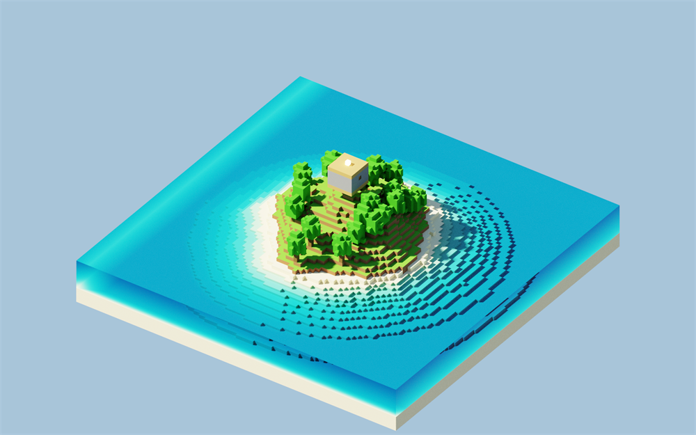
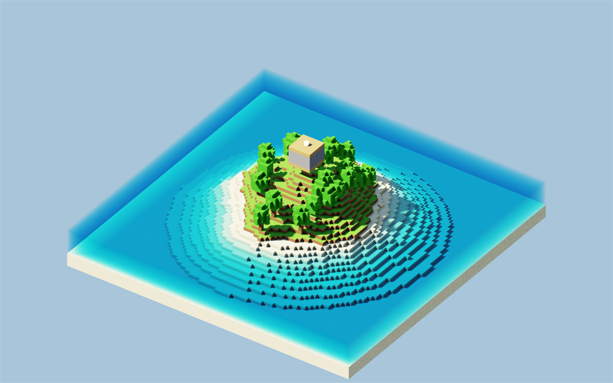
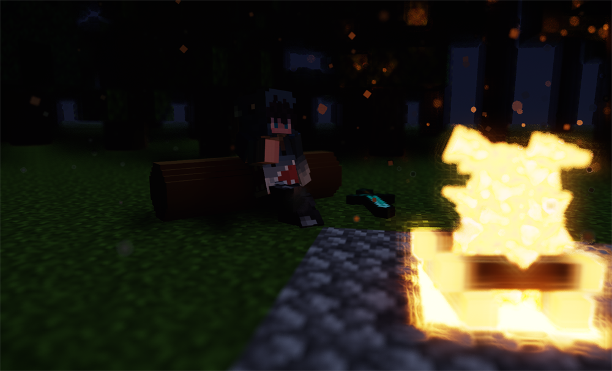
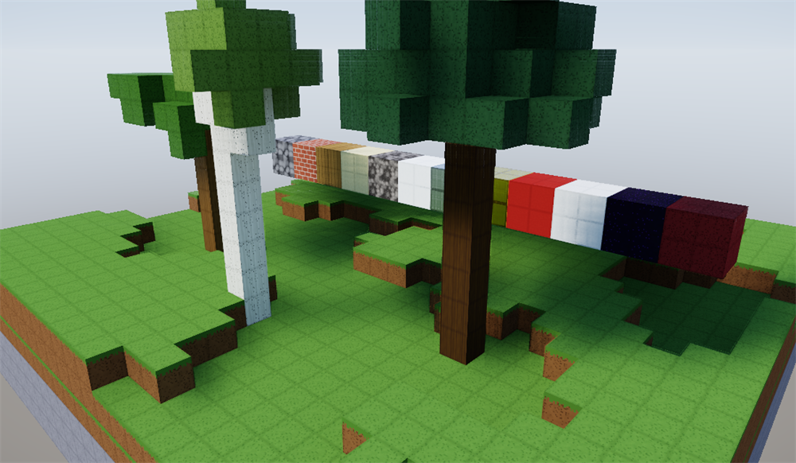
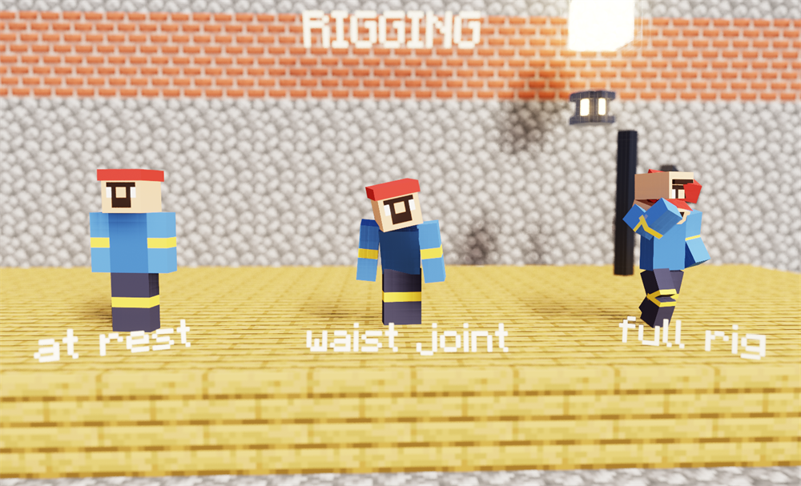
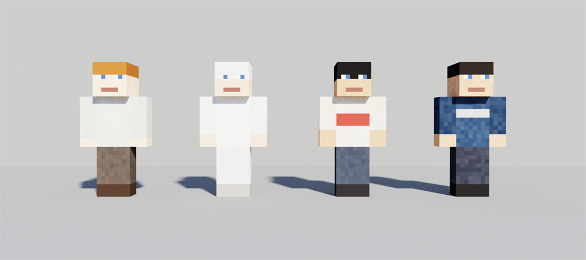
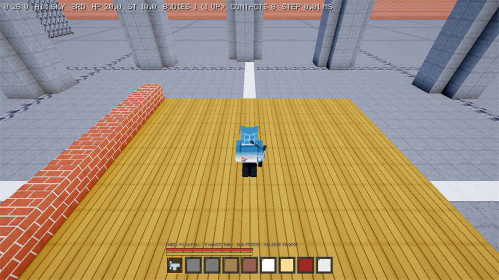

# Gallery

[← README](../README.md) · [по-русски](gallery.ru.md)

Every image below was produced by a scene in this repository, named under it.
Nothing was retouched: what the tracer wrote is what is here, downscaled to
1000 pixels wide and nothing else.

Some are marked **game textures**. Those were rendered against a Minecraft
installation the engine read at load time — the engine contains none of that
artwork, and those scenes fall back to a flat palette or to generated textures
without it. Everything unmarked is the engine's own output all the way down:
textures built in code, characters drawn in code, font included.

---

## The renderer

**`scene_diorama`** — generation, a forest of three species, a ruin, a
character, depth of field and the whole post chain, in one frame.
*(game textures)*

**`scene_cornell`** — a voxel Cornell box. The reason it exists is that colour
bleeding onto the white walls is either right or it is not, and nothing about
this scene lets a mistake hide.

**`scene_island_pt`** and **`scene_first_world`** — the same island, path
traced and then rendered directly. The pair is the argument for global
illumination: the second is not darker, it is *flatter*, and the shadowed
faces of the first are lit by the ground rather than by an ambient constant.

---

## Materials, light and style

**`scene_campfire`** — night in a forest, a sitting pose, and a fire built out
of the game's own textures. *(game textures)*

**`scene_sprites`** — a hall with shafts of light. The dust is thousands of
alpha-cut quads lit by the shaft they hang in, the embers over the lava emit,
and the floating label casts a shadow and turns up in the reflection, because
it is real geometry frozen towards the camera rather than a billboard.
*(game textures)*

**`scene_props`** — items extruded from their textures into voxels, and
hand-built props: a barrel, a lantern, crystals. Placed off the lattice, so
they turn. *(game textures)*

**`konstruct textures`** — every block texture the engine generates for
itself, and a traced showcase made of them. No Minecraft anywhere in this one.

---

## Characters

**`scene_strike`** — a swing in a mine: an elbow cut into the arm, the pickaxe
parented to the forearm through the same joint matrix the tracer uses, cel
shading with the outline taken from depth and normals. *(game textures)*

**`scene_portrait`** — cel on a flat backdrop. The eyes were found on the skin
by the scanner, painted out, and rebuilt on joints of their own so they can
look somewhere.

**`scene_rigging`** — rest, a fold at the waist, and the full rig. Parenting is
the whole subject: turning the torso takes the head and the arms with it.

**`scene_cast`** — the four characters the film is cast from, drawn in code by
`scenes/common/skins.hpp`. No file was read to make this picture.

---

## The game

**`konstruct`** — a generated world, first person, with the hand holding what
is in the hotbar.

**`konstruct lift`** — the physgun pointed at the world rather than at a body:
the cell is emptied and a rigid body of the same size and colour stands up
where the block was. A block cannot turn, so a block being carried at an angle
has to stop being one.
